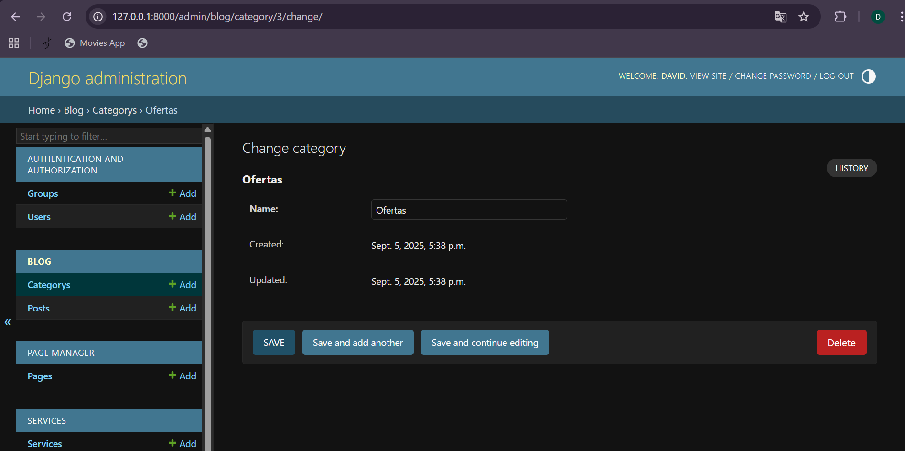

🐾 Neko Cream - Proyecto de Pruebas en Django

Proyecto experimental desarrollado con Django 5, con fines educativos y de prueba. Permite explorar la creación de aplicaciones web completas con gestión de contenido, páginas dinámicas, formulario de contacto y un panel de administración personalizado.

🌟 Características principales
🛠️ Panel de administración personalizado

Gestión de usuarios y grupos.

Gestión de contenido del blog:

Posts con títulos, imágenes, autor, fecha de publicación y categorías.

Gestión de páginas estáticas.

Administración de servicios:

Títulos, subtítulos, contenido enriquecido (CKEditor) e imágenes.

Administración de enlaces a redes sociales.

Campos de solo lectura (created, updated) y ordenamiento automático.

Búsquedas y filtros mejorados en el admin.

🎨 Frontend dinámico

Contenido cargado directamente desde el admin de Django:

Inicio, Historia, Servicios, Visítanos, Contacto, Blog.

Diseño responsivo con Bootstrap 5.

Formularios funcionales con validación, incluyendo el formulario de contacto.

Contenido enriquecido con CKEditor en servicios y posts.

⚙️ Backend

Implementado con Django 5.2.

Cada app (blog, services, pages, contact, social) tiene sus propias vistas (views.py) y rutas (urls.py).

Modelos principales:

Blog: Posts y Categorys.

Services: Productos y servicios.

Pages: Páginas personalizadas.

Social Links: Enlaces a redes sociales.

Formulario de contacto usando forms.Form y EmailMessage.

Archivos subidos (imágenes) en media/.

Archivos CSS/JS y librerías externas en static/.

Dependencias clave: django-ckeditor, pillow, psycopg2-binary, whitenoise.

👤 Experiencia de usuario

Blog con posts, categorías e imágenes.

Servicios con títulos, subtítulos, descripciones y fotografías.

Formulario de contacto con validación y confirmación de envío.

Navegación intuitiva y moderna.

🗂 Estructura del proyecto
webempresa/
├─ core/        # Plantillas y recursos estáticos
├─ services/    # Gestión de servicios
├─ blog/        # Gestión de posts y categorías
├─ pages/       # Gestión de páginas estáticas
├─ contact/     # Formulario de contacto
├─ social/      # Enlaces a redes sociales
├─ media/       # Archivos subidos
├─ staticfiles/ # Archivos estáticos recolectados
├─ manage.py
└─ requirements.txt

🚀 Instalación rápida
💾 Clonar el repositorio
git clone https://github.com/davidvivascamargo/webempresa.git
cd webempresa

🐍 Crear y activar entorno virtual
python -m venv env
source env/bin/activate  # Linux/Mac
env\Scripts\activate     # Windows

📦 Instalar dependencias
pip install -r requirements.txt

🛠️ Aplicar migraciones
python manage.py migrate

🔑 Crear superusuario
python manage.py createsuperuser

🖥️ Ejecutar servidor local
python manage.py runserver

Accede a la web: http://127.0.0.1:8000/

Admin: http://127.0.0.1:8000/admin/

📝 Notas importantes

Proyecto experimental; no optimizado para producción.

Todo el contenido se gestiona desde el panel de administración.

Formulario de contacto requiere configuración de correo en settings.py.

Imágenes y archivos subidos se almacenan en media/.

Estilos y scripts se cargan desde static/ y librerías externas (Bootstrap, Font Awesome).

📌 Tecnologías usadas

Python 3.11+

Django 5.2.6

CKEditor

Bootstrap 5

SQLite (por defecto)

Whitenoise

Pillow, psycopg2-binary, dj-database-url, gunicorn

# WebEmpresa - Proyecto Django

Proyecto desarrollado con Django 5, JavaScript y Python. Incluye funcionalidades de registro, login, gestión de noticias, películas y reseñas, así como un panel de administración.

---

## Capturas del Proyecto

### Panel de administración

### Vistas del sitio

